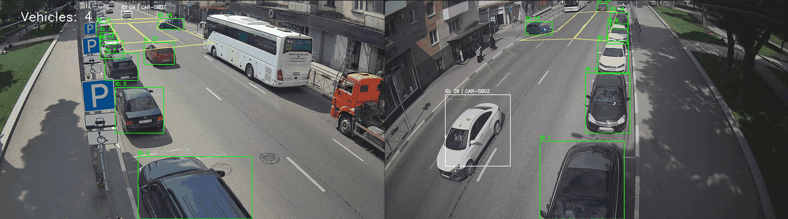

# YOLOv8 Dual-View Vehicle Tracker & Counter

[](https://www.python.org/)
[](http://mypy-lang.org/)
[](https://ultralytics.com/)
[](https://python-poetry.org/)
[](https://opensource.org/licenses/MIT)

An advanced vehicle tracking system that simulates a dual-camera setup to detect, count, and transfer vehicle identities across two adjacent video feeds. This project leverages the power of YOLOv8 for real-time object detection and tracking, and is built with a highly modular, readable, and type-safe codebase.

Усовершенствованная система трекинга автотранспорта, которая эмулирует двухкамерную систему для распознавания, подсчета и передачи идентификаторов машин между двумя соседними видеостримами. Проект построен на основе YOLOv8 для идентификации и отслеживания объектов в реальном времени.
## Demo



## Key Features

-   **Dual-View Simulation**: Processes a wide-angle video feed as two separate, interconnected camera views (View A and View B).
-   **Vehicle Detection & Counting**: Utilizes a pre-trained YOLOv8 model to accurately detect and count vehicles as they enter a designated area in View A.
-   **Persistent Object Tracking**: Employs YOLOv8's built-in tracking capabilities to assign a temporary `track_id` to each vehicle in each view.
-   **Unique ID Transfer**: Implements a sophisticated logic using trigger zones to permanently transfer a custom-generated, unique ID (e.g., `CAR-XYZ`) from a vehicle in View A to its corresponding appearance in View B.
-   **Customizable Detection Zones**: A user-friendly annotation tool is provided to draw and configure the five polygonal zones required for the counting and transfer logic.
-   **High-Quality Codebase**: The project has been meticulously refactored for maximum readability, maintainability, and robustness.
    -   **Object-Oriented Design**: Logic is encapsulated in dedicated classes (`VehicleTracker`, `Annotator`).
    -   **Modular Structure**: Configuration, core logic, and visualization are separated into distinct modules.
    -   **Strict Type Safety**: Fully type-hinted with `mypy` running in strict mode to prevent common runtime errors.


## Реализация

- **🎯 Эмуляция двухкамерной системы**
  Обрабатывает видеопоток с широким углом обзора как два раздельных, но взаимосвязанных видеовхода (Вид A и Вид B)

- **🚗 Детекция и подсчет транспорта**
  Использует предобученную модель YOLOv8 для точного обнаружения и подсчета транспортных средств при их въезде в заданную зону в Виде A

- **📹 Непрерывный трекинг объектов**
  Применяет встроенные возможности YOLOv8 для назначения временного `track_id` каждому транспортному средству в каждом виде

- **🔄 Перенос уникального идентификатора**
  Реализует сложную логику с использованием триггерных зон для постоянного переноса кастомного уникального ID (например, `CAR-XYZ`) с транспортного средства в Виде A на его соответствующее появление в Виде B

- **⚙️ Настраиваемые зоны детекции**
  Предоставляет удобный инструмент аннотации для рисования и конфигурации пяти полигональных зон, необходимых для логики подсчета и переноса

- **💻 Высококачественная кодовая база**
  Проект был тщательно рефакторизован для достижения максимальной читаемости, сопровождаемости и надежности
  - **Объектно-ориентированный дизайн** — логика инкапсулирована в выделенные классы (`VehicleTracker`, `Annotator`)
  - **Модульная структура** — конфигурация, основная логика и визуализация разделены на отдельные модули
  - **Строгая типобезопасность** — полная типовая аннотация с `mypy` в строгом режиме для предотвращения распространенных ошибок времени выполнения


## Tech Stack

-   **Python 3.12**
-   **Ultralytics YOLOv8**: For object detection and tracking.
-   **OpenCV**: For video processing and drawing annotations.
-   **NumPy**: For efficient numerical operations.
-   **Shapely**: For geometric operations (point-in-polygon tests).
-   **Poetry**: For modern dependency management and packaging.
-   **Mypy**: For static type analysis.

## Installation

Follow these steps to set up the project environment on your local machine.

1.  **Clone the repository:**
    ```bash
    git clone https://github.com/valed-dm/y8_cntr.git
    cd y8_cntr
    git switch dev
    ```

2.  **Install dependencies using Poetry:**
    (If you don't have Poetry, [install it first](https://python-poetry.org/docs/#installation)).
    ```bash
    poetry install
    ```
    This command will create a virtual environment and install all necessary packages from the `pyproject.toml` file.

3.  **Place Required Files:**
    -   Place your video file in the `data/` directory. The project is configured for `data/video_obzor_new_cam_yos_2.avi`.
    -   Place your trained YOLOv8 model in the `src/` directory. The project is configured for `src/model_only_car.pt`.

## Usage

The project consists of two main steps: first annotating the zones, then running the main tracker.

### 1. Annotate Detection Zones

Before running the tracker, you must define the five detection and transfer zones.

-   **Run the annotation script:**
    ```bash
    poetry run python src/dual_zone_tracker/annotate_dual_view.py
    ```
-   **Follow the on-screen instructions:** A window will appear with a frame from your video. You will be prompted to draw five polygons one by one. The previously drawn polygons will remain on screen to help with precise placement.
-   **Output:** The script will generate a `config/dual_view_polygons.json` file containing the coordinates of your zones.

### 2. Run the Vehicle Tracker

Once the zones are configured, you can run the main tracking script.

-   **Execute the main script:**
    ```bash
    poetry run python src/main_dual_view.py
    ```
-   A window will pop up showing the real-time processing of the video.
-   The final annotated video will be saved to `output/output_dual_video.mp4`.

## Project Structure

The project is organized into a clean, modular structure to ensure separation of concerns.

.
├── config/
│ └── dual_view_polygons.json # Stores the coordinates of the detection zones
├── data/
│ └── video_obzor_new_cam_yos_2.avi # Input video file
├── output/
│ └── output_dual_video.mp4 # The final processed video
├── src/
│ ├── dual_zone_tracker/
│ │ ├── init.py
│ │ ├── annotate_dual_view.py # The interactive zone annotation tool
│ │ ├── drawing.py # Handles all OpenCV drawing logic
│ │ ├── settings.py # Centralized configuration and paths
│ │ └── tracker.py # Core class (VehicleTracker) for state and logic
│ │
│ ├── main_dual_view.py # Main script to orchestrate the application
│ └── model_only_car.pt # The YOLOv8 model file
│
├── pyproject.toml # Project metadata and dependencies for Poetry
└── README.md # This file


## Future Improvements

-   **License Plate Recognition**: Enhance the system by using an LPR model to assign the actual license plate number as the unique ID.
-   **Re-ID Models**: For more complex scenarios with larger gaps between camera views, integrate a deep learning-based Re-Identification model to improve tracking robustness.
-   **Web Dashboard**: Develop a web-based UI (e.g., using Flask or FastAPI) to display the live video feed and tracking statistics.
-   **Database Integration**: Store tracking data and vehicle counts in a database (like PostgreSQL or InfluxDB) for long-term analysis.
-   **Containerization**: Package the application with Docker for easy, cross-platform deployment.


## На перспективу:

- **🚗 Распознавание номерных знаков**
  Усовершенствование системы с использованием LPR-модели для назначения фактического номерного знака в качестве уникального идентификатора

- **🔄 Re-ID модели**
  Для более сложных сценариев с большими промежутками между камерами - интеграция моделей повторной идентификации на основе глубокого обучения для повышения надежности трекинга

- **🌐 Веб-дашборд**
  Разработка веб-интерфейса (на базе Flask или FastAPI) для отображения видеопотока в реальном времени и статистики отслеживания

- **💾 Интеграция с базой данных**
  Сохранение данных трекинга и подсчетов транспортных средств в базе данных (например, PostgreSQL или InfluxDB) для долгосрочного анализа

- **🐳 Контейнеризация**
  Упаковка приложения в Docker для простого кроссплатформенного развертывания
